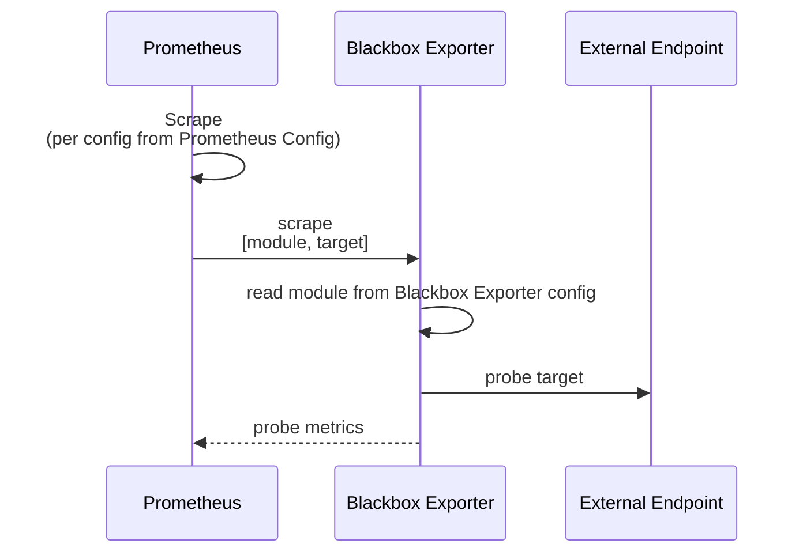

# Monitoring: Prometheus & Grafana

## Usage

To scrape metrics with Prometheus on a pod, use the following pod-level or service-level (preferred) annotations.

_NOTE: All of these annotations are customized in the prometheus config (prometheus.yaml) based on https://prometheus.io/docs/prometheus/latest/configuration/configuration/#relabel_config and https://github.com/prometheus/prometheus/blob/release-2.49/documentation/examples/prometheus-kubernetes.yml._

```yaml
# the prometheus config is configured to look for this
prometheus.io/scrape: "true"
```

To scrape metrics with Prometheus on a specific port or path can optionally use the below annotations:

```yaml
prometheus.io/port: "3000"
```

```yaml
prometheus.io/path: "/metrics"
```

This works due to relabels in the prometheus.yaml configuration.

To determine these values it depends entirely on the app, so will need to read their docs. Sometimes others publish their own "exporters" for exporting metrics from an app in a proprietary way and publishing them in a way prometheus can consume.

## Grafana

Guide: https://grafana.com/docs/grafana/latest/setup-grafana/installation/kubernetes/

## Prometheus

Guide: https://phoenixnap.com/kb/prometheus-kubernetes
Reference: https://prometheus.io/docs/prometheus/latest/installation/

## Todo:

- transmission metrics: https://github.com/sandrotosi/simple-transmission-exporter

## Monitoring Uptime with Prometheus Blackbox Exporter

Monitoring uptime with probes to arbitrary endpoints is done via the https://github.com/prometheus/blackbox_exporter which allows "blackbox" probing of endpoints over HTTP, HTTPS, DNS, TCP, ICMP and gRPC.

This works tightly with Prometheus to do it's work. The configuration of new probes requires coordinating config in Prometheus and Blackbox Exporter.

### Visual



### Description

- The blackbox exporter has a config in `./base/blackbox-exporter/config/blackbox-config.yaml` that defines the following:
  - A set of "modules" that configure the types of probes can be performed.
  - Modules describe things such as timeouts, protocol used, and and other settings about the protocol being used for the probe (e.g. ssl, http version, "success" response codes, metrics to grep from response, etc.)
- Blackbox Exporter serves stats about each external service probe on port 9115 as a prometheus scrape endpoint. Prometheus probes this exporter periodically and collects stats.
- The actual probes being conducted to external services are configured in Prometheus by hitting blackbox-exporter's `<host>:9115/probe?target=<target_endpoint>&module=<module_name>` endpoint where `<target_endpoint>` is the external endpoint to probe and `<module_name>` is the blackbox-exporter's configured module to use for the probe (e.g. with timeout settings or fine-grained protocol settings).
- **Interval**: The interval of the probe to the external service is based on how frequently Prometheus scrapes the exporter's probe endpoint. So you control interval in prometheus config by adding scrape configs in `./base/prometheus/config/*.scrape_config.yml`
- Grafana can show those stats (obviously)
- Alertmanager can alert on those stats (obviously)!

### TODO

- [x] Grafana config dashboard for coinpoet
- [x] Alertmanager for coinpoet

### Notes to self:

The using annotations on the pod/service to tell prometheus to scan the exporter isn't ideal in this case since there are multiple scrapes coming into this exporter (one for each site/url to check). The config for these blackbox arbitrary endpoints are in the prometheus config. See the `*.scrape_config.yml` files.

## Notes to self

### Why not Prometheus Operator?

I looked at https://github.com/prometheus-operator/prometheus-operator and https://grafana.com/blog/2023/01/19/how-to-monitor-kubernetes-clusters-with-the-prometheus-operator/ and found the docs hard to follow. E.g. there is no reference on the CRDs. I found some simple articles on prometheus setup and configuring it with configmaps that looked more straightforward for now.
